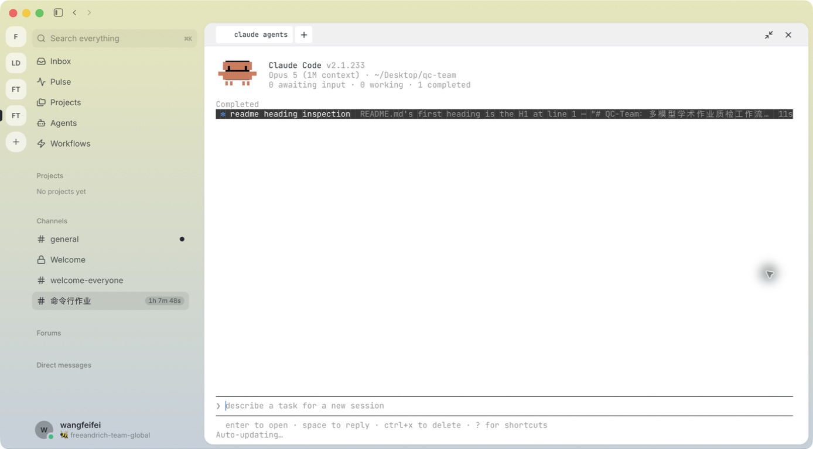
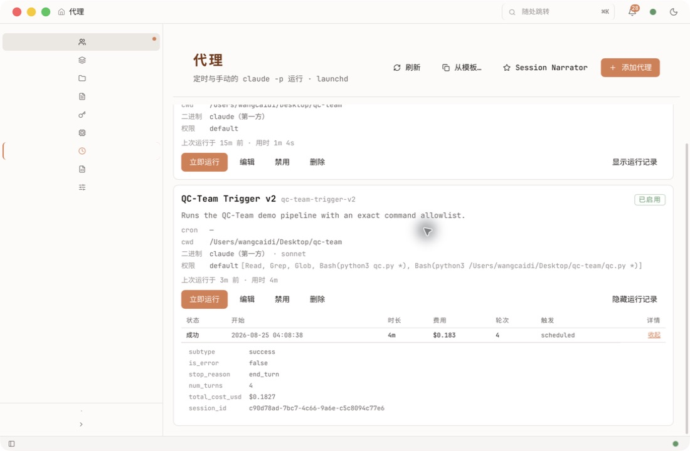

# QC-Team

## 把上一个 agent team 升级成可审计的真实团队

**王彩迪** · 2026 年 8 月 25 日

<!--
本套幻灯片用 Marp CLI 从 Markdown 渲染：
npx @marp-team/marp-cli presentation/slides.md -o presentation/output.html
主题是可复用的 CSS，换项目只换内容不换样式。
-->

---

## 这套片子的一条规矩

> **自述是元数据，产物才是证据。**

凡是本片写「✅ 已完成」的，都能在仓库里找到对应产物或命令输出。
凡是**还没跑出来的，标「未完成」，不标 ✅**。

---

<!-- _class: lead -->

# 1. 解决的是什么真问题

---

## 留学作业质检的两个致命风险

- **文献造假** —— 参考文献根本不存在（学生或 AI 杜撰）
  单个 AI 复查无效：它会幻觉出看似真实的假文献来附和提问者
- **引用漂移** —— 文献真实存在，但原文结论与稿件拿它支撑的论点方向相反

这两类问题决定一份作业会不会触碰学术诚信红线。

---

## 三模型交叉核验

| 角色 | 由谁扮演 | 放行权 |
|---|---|---|
| `qc-conductor` 主审 | Claude | 强核票 1/2 |
| `qc-verifier` 复核 | Codex | 强核票 1/2 |
| `qc-reporter` 整理 | MiniMax | 无强核票，异议可阻断 |

选不同厂商的模型是刻意的：同一个模型跑三遍，盲区依旧。

---

## 确定性地基：文献真假不交给 AI

```bash
$ python3 qc.py samples/demo_稿件样例.txt
[1/1] 核验 10.1016/j.example.2016.01.001 ... 查无此文献！
```

DOI 存在性走 **Crossref 真实 API**，元数据逐字比对。

**能被确定性查证的事，必须交给程序而不是模型。**

---

<!-- _class: lead -->

# 2. 责权利：机器人世界里怎么分

---

## 一个 Agent 的一生：五种状态

```
BLOCKED ──依赖齐了──▶ READY ──派发──▶ RUNNING ──产物已发布──▶ COMPLETED
   ▲                                     │
   └──────上游 FAILED 向下游传播──────── FAILED
```

每个状态的进入条件都写成**可机械判定**的，例如
`COMPLETED` = 子进程 exit code 为 0 **且**产物文件字节数大于 0。

状态由 `qc_evidence.py` 的 `EvidenceRun` 独占写入，不由 Agent 自报。
（legacy `qc.py` 没有这套状态机，入口是 `scripts/run_audited_qc.py`。）

---

## 三条硬规则

1. **硬依赖强制** —— 依赖全部 `COMPLETED` 且产物可读，才允许进入 `RUNNING`
2. **禁止静默绕过** —— 读不到依赖就停下报 `BLOCKED`，不许自己重造一份上游材料
3. **失败必须传播** —— 上游 `FAILED`，下游一律 `BLOCKED`，由编排器安排返工

---

## 五道闸门：顺序不是流程图，是许可制

生产编排 `scripts/run_audited_qc.py` 的 `required_gates`，闸门名与代码逐字一致：

| 闸门 | 代码名 | 判据 |
|---|---|---|
| 1 来源 | `provenance` | 上游 DIP manifest 存在，或显式声明无上游 |
| 2 基线 | `baseline_integrity` | 稿件已冻结并记录 SHA-256 |
| 3 文献证据 | `reference_evidence` | 每个 DOI 都有 Crossref 结果，无一条留空 |
| 4 双强核 | `independent_dual_review` | 关键事实 2/2 一致，任一方 UNVERIFIED 即不通过 |
| 5 放行 | `release` | 八个板块齐全，红黄绿灯有对应依据 |

每道闸门都要附 evidence locator，且文件须在 run 目录内真实存在。**闸门 4 不通过，闸门 5 不得翻案。**

---

## 责权利矩阵

| Agent | 责 | 权 | 利（目标函数） |
|---|---|---|---|
| 主审 | D1–D7 逐维度出结论、带 locator | 强核票 1/2 | 让「未被复核就放行」归零 |
| 复核 | 从原始材料独立重判，不照抄主审 | 强核票 1/2 | 让「主审漏判被下游发现」归零 |
| 整理 | 七项机械扫描、综合出唯一报告 | 异议可立即阻断 | 让「报告里出现无依据条目」归零 |

**三个角色都没有写文件的权限**——产物由编排器落盘，「谁写了什么」才唯一可追溯。

---

## 「利」在机器人世界里是什么

不是报酬，是**被复用的资格**。

产物可回溯、结论可复现的角色，下一次运行才会继续加载它；
反复产出不可核验结论的角色，应当被改写或删除。

---

<!-- _class: lead -->

# 3. 这一周改了什么

---

## 升级清单：三种状态，不合并成一个 ✅

「写下来了」「单元测试验证过」「真实跑过一次」是三件事。

| 项目 | 已定义 | 单测验证 | 真实运行 |
|---|---|---|---|
| 正式 Agent 定义 `.claude/agents/` | ✅ | ✅ | ✅ |
| `.claude-plugin/plugin.json` + `CLAUDE.md` | ✅ | ✅ | ✅ |
| 责权利契约（五状态 + 5 闸门 + 矩阵） | ✅ | ✅ | 待生产 run |
| 证据运行时 SHA-256 封存 | ✅ | ✅ | 仅演示 run |
| DIP → QC 交接 | ✅ | ✅ | **未完成** |
| Claudepot 触发 | ✅ | — | ✅ 2026-08-25 成功 |

---

## 关键一改：角色定义成为单一事实来源

改之前：`roles/01_主审_claude.md` —— 裸 Markdown，不在任何被识别的路径上。

改之后：`.claude/agents/qc-conductor.md` —— 一份文件两处用

- `qc.py` 用 `read_agent()` 剥掉 frontmatter 当角色提示词
- Claude Code 直接把它当 subagent 加载

改行为只改这一份文件，`qc.py` 只负责传递。

---

<!-- _class: lead -->

# 4. 运行证据

---

## 测试（本次 commit 实测）

```bash
$ python3 -m unittest discover -s tests
Ran 16 tests in 0.104s

OK
```

16 个测试覆盖：稿件读取、Agent 定义加载、frontmatter 剥离、
非法状态跳转、阻断恢复、完成拒绝、产物篡改、事件日志篡改、DIP 交接、双审隔离。

---

## 端到端质检（2026-08-18 那次真实运行）

| 环节 | 结果 | 产物 |
|---|---|---|
| Crossref 核验 | 通过 | 故意植入的假 DOI 被判「查无此文献」 |
| Claude 主审 | 通过 | 约 15 KB 的 D1–D7 意见，红灯 |
| Codex 复核 | 通过 | 约 7.4 KB 复核意见，指出主审过度表述 |
| MiniMax 整理 | 通过 | 约 6.5 KB 最终报告 |

系统没有把假 DOI「圆过去」，最终报告给红灯「不可提交」。

⚠️ 这一次跑的是 legacy `qc.py`：**复核拿到的 prompt 里带着主审答案，不是盲判。**
真正的首轮独立只在 `scripts/run_audited_qc.py` 里，目前由单元测试验证，尚无生产 run。

---

## Agent View

启动命令是 `claude agents`（功能全名 Agent View，
`/bg` 丢后台、`claude attach <id>` 连回、`claude respawn --all` 唤醒）。

本机 Claude Code v2.1.233，满足 ≥ v2.1.139 的要求。



`0 awaiting input · 0 working · 1 completed`，工作目录 `~/Desktop/qc-team`。

---

<!-- _class: lead -->

# 5. 对照上周的高分样本

---

## 顾梦婷的作业强在哪

不是页面好看，是**一张页面同时给出可核验的硬指标**：

run id · 冻结基线 · Agent 流 · 跨厂商模型路由（含 effort 档位）·
9/9 gates · 逐条时间戳 · 产物与 action 统计 · E2E QA PASS

她的面板右上角写着 `Action Integration: NOT_CONNECTED`。

---

## 我们现在的位置（如实）

| 指标 | 顾梦婷 | 本项目 |
|---|---|---|
| 闸门 | 9/9 PASS | 5 道已定义，真实生产 run 待完成 |
| 状态机 | 有 | 有，五状态 + 可机械判定的进入条件 |
| 产物哈希封存 | 未见 | 有，SHA-256 |
| Action Integration | NOT_CONNECTED | **已接通，且真实跑成功一次** |

---

## Claudepot：真实跑通了



`QC-Team Trigger v2` · 状态**成功** · 2026-08-25 04:08:38 · 用时 4m · 4 轮 ·
`subtype: success` · `is_error: false` · `stop_reason: end_turn`

---

## 这一条是修出来的，不是一次就对

| 版本 | 结果 | 原因 |
|---|---|---|
| v1 | **失败，退出码 127** | `~/.local/bin/claude` 指向已失效的旧 Cursor 扩展；修复后又被 Bash 权限门阻断 |
| v2 | **成功** | 新 Agent 使用受限 prompt，并把权限收成精确 allowlist |

v2 的权限只给到：
`Read, Grep, Glob, Bash(python3 qc.py *), Bash(python3 /Users/wangcaidi/Desktop/qc-team/qc.py *)`

**AI 只有提议权（draft），上膛必须人来点** —— 这一条不是我们设计的，
是 Claudepot 写死的：CLI 里根本没有 `install` 这个动词。

---

## 这次运行真的产出了东西

```
reports/_refs_verified.json            Crossref: 10.1016/j.example.2016.01.001 → 查无此 DOI
reports/demo_稿件样例_1主审.md          7.5 KB
reports/demo_稿件样例_2复核.md          5.3 KB
reports/demo_稿件样例_质检报告_2026-08-25_120847.md   5.5 KB
```

最终报告结论：**红灯，不建议提交**。
抓出 3 条 🔴 严重（杜撰 DOI、卷期页与官方目录冲突、引用方向绝对化误用）。

---

<!-- _class: lead -->

# 6. 边界与下一步

---

## 还没做到的（不粉饰）

- **单轮串联**：复核实际已看到主审答案，做不到真正的三方盲判
- **缺多轮回源闭环**：遇分歧反复回原文核实、三回合仍无共识才交人裁决 —— **尚未实现**

---

## 下一步

1. 把「单轮串联」改造成「多轮循环」：主审出结论 → 自我复核 →
   与复核就分歧往返 → 逐轮把原始判断与证据落盘
2. 把 DIP 产稿 → QC 质检跑一次真实生产 run
3. 给 Claudepot agent 配上 cron 表达式，做到无人值守

---

<!-- _class: lead -->

# 谢谢

**GitHub**：https://github.com/wangfeifei-321/qc-team

```bash
git clone https://github.com/wangfeifei-321/qc-team.git
cd qc-team && cp .env.example .env   # 填 MiniMax API Key
python3 qc.py samples/demo_稿件样例.txt
```

本套幻灯片由 Marp CLI 从 `presentation/slides.md` 渲染。
